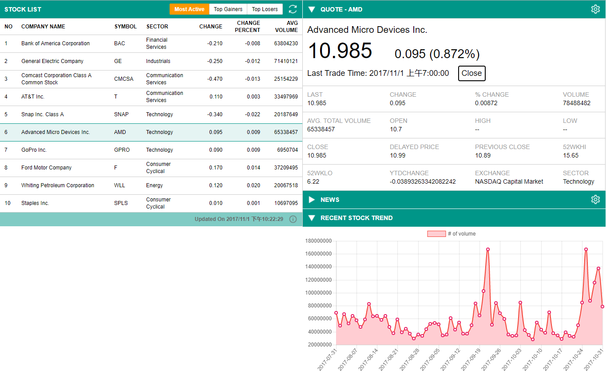
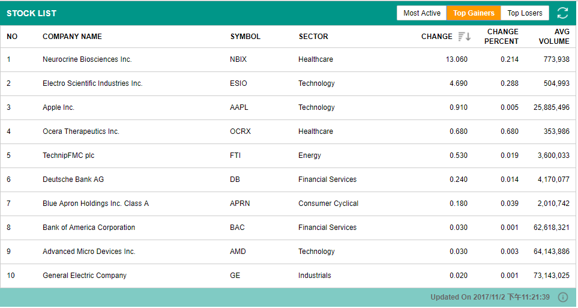
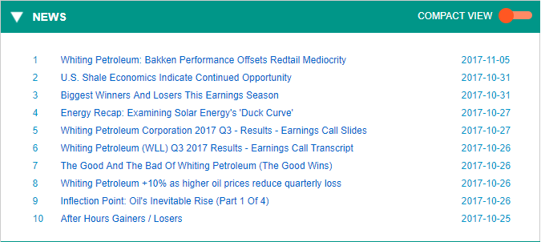
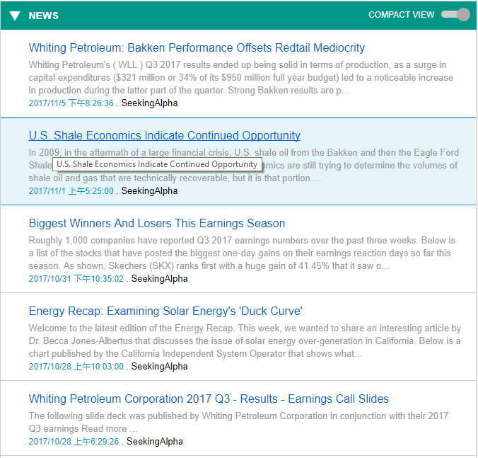

# Stock Information Display Tool

## Description:
This tool allows user to view up-to-date stocks information, news and recent data.

## Some New Features:
- Updating stock list automatically[done]
- Highlighting column header with order icon based on which type is selected[done]
- Adding complex news view - done
- Adding search bar to allow users to search stock by symbol
- Adding details table for selected stock - done
- Adding functionality to allow user config the view of stock quote table:
    - setup number of columns on each row (select between 2-6 for ux purpose) - transferring
    - setup which column data they would like to see in this table - transferring
- Allowing user to fold detail sections (quote, news, chart) by click on blue section header - done

## Demo
### Overview
This is a tool to allow user get insights about stock market with real-time stock info.

### Stock List
Stock list allows user to find top 10 stocks in different types, including "most active", "top gainers" and "top losers".
#### Features:
- Automatically update stock list with a selected type every 10 seconds, time stamp will be updated in the bottom of list;
- Retrieving real-time stock info via clicking refresh button;
- Switching list types among "most active", "top gainers" and "top losers", to find out their target stock;
- Highlighting columns based on list types with sort order;
- Selecting a specific stock to find out more details about their choice, details will show in the right panel

### Stock Details
This section will display summary and all available data of the selected stock.

Users can open a setting window for this section by clicking the top right button. They are able to select how many columns they would like to see on each row and which data they prefer to watch. Thus they can focus on fields they are interested in.

### Stock News (complex/compact)
This section will list maximum 10 latest news of the selected stocks. This section is able to be collapsed by click the section header.

There are two views that users can simply switch by clicking the toggle button. The complex view offers more information about each items, such as summary of the news.

Compact view is the default view for stock news section.

Compact View

Complex View

### Stock Chart
This section will draw a line chart about recent volume data of the selected stock. Currently, it only allows users to see the volume data. This part will be enhanced in the new repository.

## Thanks to
- [IEX Dev API](https://iextrading.com)
